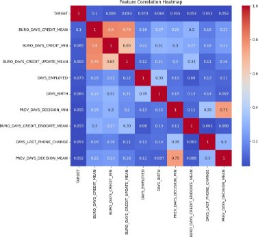
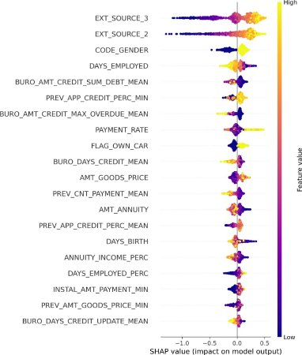

Technical Note

**Implementing the scoring model**

By : Olga Sonina

# **Introduction**

The primary objective of the present project is to develop a predictive model that accurately assesses a client’s capacity to repay a loan. Additionally, an intuitive and user-friendly inter- face is created to enhance the usability and comprehension of the model’s predictions. This initiative stems from the increasing demand for transparency in loan approval decisions, with clients seeking a clear understanding of the factors influencing their loan application outcomes.

The core problem initially posed on the Kaggle competition platform ([https://www.](https://www.kaggle.com/competitions/home-credit-default-risk/overview) [kaggle.com/competitions/home-credit-default-risk/overview](https://www.kaggle.com/competitions/home-credit-default-risk/overview)) and on the whole con- sist on how to classify clients with no or little credit history using alternative type of financial information about them.

This technical note provides an overview of the key aspects of the developed model, along with the tool and interface that have been constructed :

[https://olga-sonina-project7b-home-credit-app-v4-vwq0ku.streamlit.app](https://olga-sonina-project7b-home-credit-app-v4-vwq0ku.streamlit.app/).

The note outlines the model’s methodology, highlighting the principal features and techniques utilized to ensure accurate predictions. Additionally, the tool and interface are described, emphasizing their user-friendly design and intuitive functionalities that enable managers to easily interact with and comprehend the model’s outputs.

# **The training methodology of the model**

To construct the model the Home Credit Default Risk datasets [(https://www.kaggle.](https://www.kaggle.com/c/home-credit-default-risk/data) [com/c/home-credit-default-risk/data)](https://www.kaggle.com/c/home-credit-default-risk/data) were used. These datasets containing information about repayment history/transactional behavior/general information of the clients. The ad- ditional parameters (min, max, mean) of certain features were calculated, then datasets were merged into a big one to facilitate data treatment. The dataset was cleaned, verified on du- plicates, Nan and outlier values. The parameters were verified on Nan rate and those having more than half of missing values were removed with the aim to not imputing and save the

Figure 1: Correlation between parameters and TARGET (first line).

data original. In order to assess data leakage concerning the target variable, an examination of the parameters was conducted. This involved constructing a correlation matrix, which ul- timately revealed no significant correlations among the parameters in the dataset, indicating the absence of data leakage. The fig. ([1](#_bookmark0)) shows the most correlated to TARGET features and their coefficients of correlation.

Once data is cleaned and parameters are defined the model needs to be defined. The LGBM classifier chosen because it uses a tree-based learning algorithm that constructs decision trees in a leaf-wise manner, which helps to achieve better accuracy with fewer iterations compared to other boosting algorithms. LGBM is designed to handle large datasets and has gained popularity for its excellent performance in various machine learning tasks (Ke, 2017).

The hyperparameters for LGBM classifier were tuned using RandomizedSearchCV, a ran- domized search algorithm, to optimize the values of parameters such as maxdepth, learning rate, n-estimators, num-leaves, min-child-samples, reg-alpha, reg-lambda. The scoring met- ric ’auc-roc’ was used to evaluate the performance of different hyperparameter combinations. Subsequently, the LGBM classifier model was trained using the cross-validation technique,

which partitions the dataset into multiple subsets for training and validation. The auc-roc scoring was employed to assess the model’s performance on each fold and obtain an overall evaluation of its predictive capability.

Figure 2: Scoring while entertainment the model

# **Imbalanced classes treatment**

In the dataset used for loan approval, the rate of negative decisions (rejected loans) is signif- icantly lower compared to positive decisions (approved loans), resulting in a class imbalance issue. It is essential to address this class imbalance problem before proceeding with model training, as it can potentially affect the model’s predictive capabilities. Various techniques exist to tackle imbalanced classes effectively. For the current project, the Synthetic Minority Over-sampling Technique (SMOTE) was chosen as the preferred method. By oversampling the minority class using SMOTE, we provide the model with more balanced training examples, improving its ability to learn patterns from the minority class. Prior to training the model, the dataset underwent preprocessing steps including imputation with mean values and stan- dardization using StandardScaler. To train the model, k-fold stratified cross-validation was performed. The dataset was divided into n-splits (in this case, 5) folds using sklearn.model- selection.StratifiedKFold. This technique ensures that each fold maintains the same distribu- tion of the target variable classes as the original dataset, preventing class imbalance issues during training and evaluation. it should be noted that SMOTE re-sampled data set used only to train the model, for the rest of the work the original data set was used.

Figure 3: Cout-metier function

# **Cout metier function, the optimization algorithm and the eval- uation metric**
Once model is trained it is possible to make a prediction, for instance for the test part of the data set. The predict-proba function returns the probability of being assigned to the class of approved clients. To convert these probabilities to binary decisions (0 or 1), a threshold value needs to be defined. The default threshold value is 0.5, but it may not be optimal in our case. To optimize the false positive and false negative errors of the prediction, which have different weights, the ’cout-metier’ function was developed.

In the function, the error weights were given to false positive error 10 times higher than a false positive error. This is because of the particularity of the problem: it is 10 time worst to approve the credit to a client who won’t be able to repay the loan rather than to refuse a client to an creditworthy client. Therefore, the function will have higher values when prediction contains more false positive errors and lower values in the opposite case. The minimum of the function is resulting in the threshold of 0.83, that is very different from the default value. To evaluate the optimization due to the ’cout-metier’ function the confusion matrix constructed for both 0.5 and 0.83 thresholds.

	

Figure 4: 0.5 threshold result confusion matrix

Figure 5: 0.83 threshold result confusion matrix

# **Results**

The main result of our analysis shows a prediction F1-score of 82%. It is also necessary to investigate the possibility of overfitting in our model. To determine if there is overfitting based on the obtained log loss and AUC-ROC scores, we need to compare the scores between the training set and the validation set for each fold. If the training set scores are consistently better than the validation set scores, it suggests overfitting.

Based on the scores shown in the table, we can observe that the log loss and AUC-ROC scores for the training set and validation set are relatively close in each fold. There is no clear pattern of the training scores consistently outperforming the validation scores or vice versa. Therefore, it does not indicate significant overfitting.

# **The global and local interpretability of the model**

Feature Importances helps to identify the most influential features in the model and gain insights into the underlying relationships between the features and the target variable. By analyzing feature importances, we can prioritize feature selection, identify potential feature interactions, and improve our understanding of the problem at hand. As can be seen from the graph (feats), the more infuential features are: Payment Rate, External Source2, Days Birth, Annuity Income, Days Employed etc.

Table 1: Log Loss and AUC-ROC Score

|
Fold

AUC-ROC Score (Val)
|Log Loss (Train)|Log Loss (Val)|AUC-ROC Score (Train)|
| :-: | :-: | :-: | :-: |
|1|0\.23275|0\.23223|0\.74228|
|0\.74388||||
|2|0\.23223|0\.22925|0\.74388|
|0\.75137||||
|3|0\.22925|0\.23123|0\.75137|
|0\.74694||||
|4|0\.23123|0\.23463|0\.74694|
|0\.74746||||
|5|0\.23463|0\.23275|0\.74746|
|0\.74228||||

Figure 6: Feature importances

Based on the SHAP values (shap), we observe that high feature values of External Source, as well as Code Gender, have a significant impact on maximizing the predicted outcome. Conversely, Days Employed exhibits an inverse relationship, indicating that lower values of Days Employed contribute to higher predictions.

Figure 7: Shap values

# **The limits and possible improvements**

Improving the data set by addressing imbalanced classes and handling missing values, coupled with fine-tuning hyperparameters, can enhance the predictive capacity of the model by creat- ing a more representative and robust training environment. By optimizing data engineering techniques and hyperparameter selection, the model’s performance can be significantly en- hanced, leading to more accurate predictions and better overall results.

# **The analysis of the Data Drift evidently report**

The analysis of Data drift helps to identify and monitor changes in the data distribution over time. Data drift refers to the phenomenon where the statistical properties of the input data change, which can impact the performance and reliability of the predictive model. In our case we consider actual data is train.csv and new data is test.csv. As it shown in the evidently report, there is no data drift detected in the entire dataset (taking into account that drift threshold=0.5); only 9.091% of columns which represent 11 columns over 121 are drifted (see report.html). Drift occures in

AMT\_REQ\_CREDIT\_BUREAU\_MON, AMT\_REQ\_CREDIT\_BUREAU\_WEEK, AMT\_REQ\_CREDIT\_BUREAU\_QRT, AMT\_GOODS\_PRICE,

AMT\_CREDIT, NAME\_CONTRACT\_TYPE, AMT\_ANNUITY, DAYS\_LAST\_PHONE\_CHANGE, AMT\_REQ\_CREDIT\_BUREAU\_DAY, AMT\_INCOME\_TOTAL.

Although the evident tests did not detect drift in the entire dataset, two features with high feature importance AMM\_ANNUITY and AMM\_CREDIT were found to have drifted. Con- sequently, the drift in these features could potentially impact the prediction capacity of the model. Since there is no ’TARGET’ value available for the ’test.csv’ dataset, it is not possible to assess the difference in model performance due to the drift of these two variables. However, their feature importance suggests they could still have an effect.

# **Reference:**

Ke, G., Meng, Q., Finley, T., Wang, T., Chen, W., Ma, W., Ye, Q., Liu, T. Y. (2017). Light- GBM: A highly efficient gradient boosting decision tree. In Advances in neural information processing systems (pp. 3149-3157).
